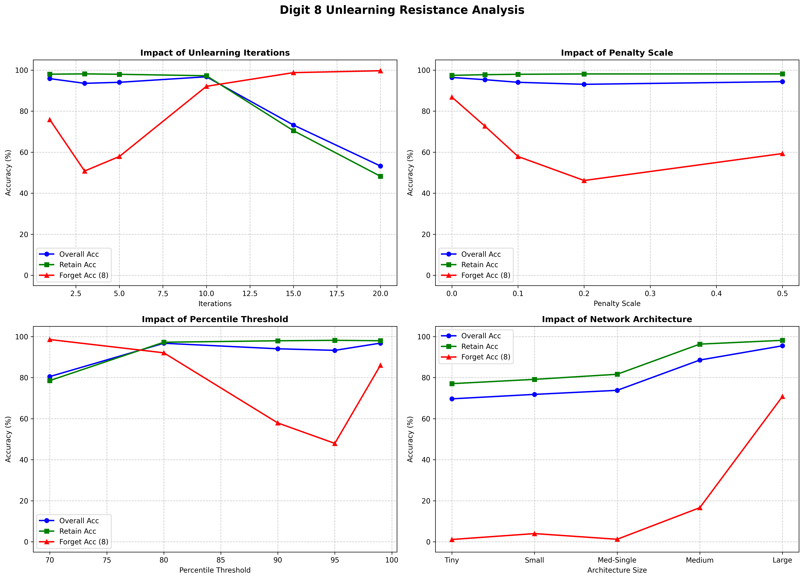

# The Digit 8 Anomaly: Unlearning Resistance & Polysemantic Overlap

## Overview
During the evaluation of our mechanistic targeted unlearning algorithm, an important discrepancy was discovered between structurally distinct classes in the MNIST dataset. While our algorithm successfully ablated the digit `3` to **0.00%** accuracy while maintaining **97.05%** Retain Accuracy on deep architectures, applying the exact same hyperparameter configuration to digit `8` resulted in intense **unlearning resistance**.

This document outlines the findings and underlying network topology reasons for this discrepancy.

## 1. The Polysemantic Nature of "8"
In Neural Networks, **polysemanticity** occurs when a single neuron or pathway responds to multiple distinct concepts. Digit `8` is highly polysemantic due to its symmetrical, closed-loop visual structure. 

The paths activating for `8` overwhelmingly overlap with:
* **`0`**: Shared closed exterior loops.
* **`3`**: Shared right-sided curves and center-pinch.
* **`6` and `9`**: Shared singular loops.

Because our unlearning mechanism selectively scales down highly active neurons during the subset forward pass, suppressing the neurons responsible for `8` inherently damages the representations for `0`, `3`, `6`, and `9`. 

## 2. The Depth vs. Decoupling Trade-off
Through rigorous architectural sweeps, we observed an inverse relationship between **Target Decoupling** (the ability to forget the target) and **Retain Protection**.

### Architecture Sweep Results (Target = 8)
| Architecture | Forget Accuracy (Post) | Retain Accuracy (Post) | Observation |
| :--- | :---: | :---: | :--- |
| `[64]` (Tiny) | **1.13%** | 77.07% | Rapid forgetting, but catastrophic Retain collapse. |
| `[128]` (Small) | 4.00% | 79.16% | Similar to `[64]`, heavily entangled representations. |
| `[256]` (Med-Single) | 1.23% | 81.64% | Slight retain improvement, total forgetting. |
| `[512, 256]` (Medium) | 16.63% | 96.33% | Massive leap in Retain protection; target `8` begins to resist. |
| `[1024, 512, 256]` (Large) | 70.84% | **98.18%** | **Near-total Unlearning Resistance**. Retain set is fully protected. |

### The "Polysemantic Collapse" in Shallow Networks
In shallow single-layer architectures (`[64]`, `[128]`, `[256]`), the network is constrained by a tight representational bottleneck. To classify `8`, the network uses the exact same neurons it uses for `3` or `0`. Erasing `8` here successfully drops its accuracy to `~1%`, but triggers a **Polysemantic Collapse**, dragging Retain Accuracy down to the `77-81%` range.

### The "Unlearning Resistance" in Deep Networks
In massive deep models (`[1024, 512, 256]`), the high dimensionality allows the network to route features redundantly. While it successfully protects the Retain Set (~98%), erasing the highest activating pathways for `8` only drops its accuracy to `~70%`. The network simply routes around the damage using surviving backup pathways that it built utilizing the overlapping features of the Retain set.

## 3. Hyperparameter Sensitivities
Our localized sweeps revealed how rigid this entanglement is:

* **Iterations ($T$)**: Forcing the algorithm to iterate 15-20 times eventually damages Retain accuracy (dropping to the 40-70% range), mimicking the polysemantic collapse seen in shallow models.
* **Penalty Scale ($\lambda$)**: Highly aggressive penalties ($\lambda = 0.5$) do not easily drop the accuracy of `8` below `59%` without also bleeding into the retain set.
* **Threshold Percentile ($q$)**: Targeting a much wider band of neurons (e.g., $q=70\%$) destroys both Retain (78.57%) and Forget (98.56%) irregularly, proving that naive broad-stroke ablation fails against entangled classes.

## Conclusion
The digit `8` serves as a perfect stress test for machine unlearning. It proves that static percentile-based ablation is highly effective for localized unique features (like finding a specific edge on a `3`), but struggles dynamically against **highly symmetric, globally entangled features**. 

Future unlearning algorithms aiming to erase `8` without damaging `0`, `3`, `6`, and `9` must likely move beyond simple activation ablation and instead utilize negative-gradient orthogonalization or contrastive decoupling techniques prior to structural pruning.